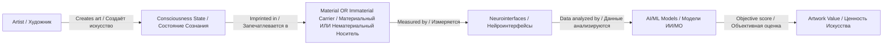

# 🧠 ASRP.art — Axionetic Sensing Reactions Platform in Art
# 🧠 ПНИР.искусство — Платформа Ноогенетического Измерения Реакций на Искусство

**Objective Art Evaluation System Through Consciousness State Imprinting in Material and Immaterial Carriers**

**Система Объективной Оценки Произведений Искусства Через Запечатлевание Состояний Сознания в Материальных и Нематериальных Носителях**

**Part of Advanced Scientific Research Projects (ASRP) Ecosystem**

**Часть Экосистемы Advanced Scientific Research Projects (ASRP)**

---

## 📖 TABLE OF CONTENTS / СОДЕРЖАНИЕ

- [🎯 System Purpose / Назначение Системы](#-system-purpose--назначение-системы)
- [🔥 Key Innovation / Ключевая Инновация](#-key-innovation--ключевая-инновация)
- [🧠 How It Works / Как Это Работает](#-how-it-works--как-это-работает)
- [📊 Objective Evaluation / Объективная Оценка](#-objective-evaluation--объективная-оценка)
- [🏛️ Art Marketplaces / Арт-Площадки](#-art-marketplaces--арт-площадки)
- [📚 Scientific Foundation / Научная Основа](#-scientific-foundation--научная-основа)
- [📁 Documentation / Документация](#-documentation--документация)
- [🎯 Development Issues / Задачи Разработки](#-development-issues--задачи-разработки)
- [🔗 Related Repositories / Связанные Репозитории](#-related-repositories--связанные-репозитории)
- [📞 Contact / Контакты](#-contact--контакты)

---

## 🎯 SYSTEM PURPOSE / НАЗНАЧЕНИЕ СИСТЕМЫ

### **Objective Art Evaluation Through Consciousness State Imprinting**

### **Объективная Оценка Искусства Через Запечатлевание Состояний Сознания**

**ASRP.art (ПНИР.искусство)** is a system for **objective evaluation of artworks** through the **ability to imprint consciousness states** (mental/cognitive components) in material carriers.

**ASRP.art (ПНИР.искусство)** — это система для **объективной оценки произведений искусства** через **способность запечатлевать состояния сознания** (ментальную/когнитивную составляющую) в материальных носителях.

### 🔬 Scientific Terminology / Научная Терминология

| Term / Термин | Definition / Определение |
|--------------|-------------------------|
| **Consciousness State Imprinting / Запечатлевание Состояния Сознания** | The process of recording mental/cognitive states in material form / Процесс записи ментальных/когнитивных состояний в материальной форме |
| **Cognitive Component / Когнитивная Составляющая** | Mental patterns, emotions, perceptions captured during art creation / Ментальные паттерны, эмоции, восприятия, запечатлённые при создании искусства |
| **Objective Evaluation / Объективная Оценка** | Measurement of artwork value through neurophysiological data analysis / Измерение ценности произведения через анализ нейрофизиологических данных |

---

## 🔥 KEY INNOVATION / КЛЮЧЕВАЯ ИННОВАЦИЯ

### Traditional Art Evaluation vs ASRP.art Objective Evaluation
### Традиционная Оценка Искусства vs Объективная Оценка ASRP.art

| Traditional Evaluation / Традиционная Оценка | **ASRP.art Objective Evaluation / Объективная Оценка ASRP.art** |
|---------------------------------------------|-------------------------------------|
| Subjective expert opinion / Субъективное мнение эксперта | **📊 Objective neurophysiological data / Объективные нейрофизиологические данные** |
| Based on reputation, history / Основана на репутации, истории | **🧠 Based on consciousness state imprint quality / Основана на качестве запечатлевания состояния сознания** |
| Cannot measure mental component / Нельзя измерить ментальную составляющую | **✅ Measures cognitive imprint / Измеряет когнитивный отпечаток** |
| Market manipulation possible / Возможны рыночные манипуляции | **🔬 Scientific validation / Научная валидация** |

---

## 🧠 HOW IT WORKS / КАК ЭТО РАБОТАЕТ

### **Consciousness State Imprinting Process / Процесс Запечатлевания Состояния Сознания**

### 📊 Carrier Types / Типы Носителей

| Type / Тип | Examples / Примеры | Measurement / Измерение |
|-----------|-------------------|------------------------|
| **Material / Материальный** | Canvas, sculpture, paper / Холст, скульптура, бумага | Microscopy, spectroscopy |
| **Digital / Цифровой** | NFT, blockchain, VR/AR / NFT, блокчейн, VR/AR | Hash verification, metadata |
| **Energetic / Энергетический** | EM fields, quantum states / ЭМ поля, квантовые состояния | EMF measurement, quantum sensors |
| **Informational / Информационный** | Consciousness patterns / Паттерны сознания | AI pattern analysis |

### 📊 Evaluation Criteria / Критерии Оценки

| Criterion / Критерий | Measurement / Измерение | Scientific Basis / Научная Основа |
|---------------------|------------------------|----------------------------------|
| **Imprint Quality / Качество Отпечатка** | Neurodata signal clarity / Ясность сигнала нейроданных | EEG, MEG, fMRI patterns |
| **Cognitive Depth / Глубина Когнитивного** | Complexity of mental patterns / Сложность ментальных паттернов | AI pattern analysis |
| **State Reproducibility / Воспроизводимость Состояния** | Can others experience same state? / Могут ли другие испытать то же состояние? | Reader neurofeedback |
| **Scientific Validation / Научная Валидация** | Peer-reviewed publication / Рецензируемая публикация | ASRP.science DOI |

---

## 📊 OBJECTIVE EVALUATION / ОБЪЕКТИВНАЯ ОЦЕНКА

### **Why This Matters / Почему Это Важно**

**Current Problem / Текущая Проблема:**
- Art valuation is **subjective** / Оценка искусства **субъективна**
- No way to measure **mental/cognitive component** / Нет способа измерить **ментальную/когнитивную составляющую**
- Market driven by speculation / Рынок движется спекуляциями

**ASRP.art Solution / Решение ASRP.art:**
- **Objective measurement** through neurodata / **Объективное измерение** через нейроданные
- **Consciousness state imprint quality** as value metric / **Качество отпечатка состояния сознания** как метрика ценности
- **Scientific validation** through peer review / **Научная валидация** через рецензирование

---

## 🏛️ ART MARKETPLACES / АРТ-ПЛОЩАДКИ

### **30+ Marketplaces Analyzed / Проанализировано 30+ Площадок**

**Full database:** [`docs/art-marketplaces/GLOBAL_ART_MARKETPLACE_DATABASE.md`](docs/art-marketplaces/GLOBAL_ART_MARKETPLACE_DATABASE.md)

| Platform / Платформа | Type / Тип | Integration / Интеграция |
|----------|------|---------------------|
| **🏆 Christie's** | Auction / Аукцион | 🔴 Critical |
| **🏆 Sotheby's** | Auction / Аукцион | 🔴 Critical |
| **🌊 OpenSea** | NFT | 🔴 Critical |
| **💎 SuperRare** | NFT Gallery | 🔴 Critical |
| **🧬 Art Blocks** | Generative / Генеративное | 🔴 Critical |

---

## 📚 SCIENTIFIC FOUNDATION / НАУЧНАЯ ОСНОВА

### **Key Publications / Ключевые Публикации**

**Full database:** [`docs/scientific-references/SCIENTIFIC_REFERENCES_DATABASE.md`](docs/scientific-references/SCIENTIFIC_REFERENCES_DATABASE.md)

| Publication / Публикация | Journal / Журнал | Year |
|-------------------------|-----------------|------|
| **Banchenko Market / Рынок-Банченко** | Moscow Economic Journal № 8 | 2023 |
| **GMS & GFS / ГМС и ГФС** | J Invest Bank Finance, Vol 3 | 2025 |
| **Neurointerface Review / Обзор Нейроинтерфейсов** | ASRP Report | 2026 |
| **Banchenko Algorithm / Алгоритм Банченко** | Brain and Nerves | 2023 |

---

## 📁 DOCUMENTATION / ДОКУМЕНТАЦИЯ

### **Complete Technical Documentation / Полная Техническая Документация**

| Document / Документ | Description / Описание | Link / Ссылка |
|--------------------|----------------------|------|
| **📋 Technical Specification / Техническая Спецификация** | Complete EN/RU spec / Полная EN/RU спецификация | [`TECHNICAL_SPECIFICATION.md`](TECHNICAL_SPECIFICATION.md) |
| **🏛️ Art Marketplace Database / База Арт-Площадок** | 30+ platforms / 30+ площадок | [`docs/art-marketplaces/`](docs/art-marketplaces/) |
| **📚 Scientific References / Научные Ссылки** | All papers / Все статьи | [`docs/scientific-references/`](docs/scientific-references/) |
| **📄 Scientific PDFs / Научные PDF** | 4 research papers / 4 научные работы | [`docs/*.pdf`](docs/) |

---

## 🎯 DEVELOPMENT ISSUES / ЗАДАЧИ РАЗРАБОТКИ

### **9 Active Issues / 9 Активных Задач**

**View all:** [github.com/AdvancedScientificResearchProjects/Axionetic_Sensing_Reactions_Platform_in_Art/issues](https://github.com/AdvancedScientificResearchProjects/Axionetic_Sensing_Reactions_Platform_in_Art/issues)

| Issue / Задача | Title / Название | Owner / Владелец | Priority |
|---------|-----------------|-----------------|----------|
| [#1](https://github.com/AdvancedScientificResearchProjects/Axionetic_Sensing_Reactions_Platform_in_Art/issues/1) | Platform Architecture / Архитектура Платформы | CTO | 🔴 |
| [#2](https://github.com/AdvancedScientificResearchProjects/Axionetic_Sensing_Reactions_Platform_in_Art/issues/2) | Neurointerface Integration / Интеграция Нейроинтерфейсов | CBE | 🔴 |
| [#3](https://github.com/AdvancedScientificResearchProjects/Axionetic_Sensing_Reactions_Platform_in_Art/issues/3) | Hardware Integration / Интеграция Оборудования | Embedded | 🔴 |
| [#4](https://github.com/AdvancedScientificResearchProjects/Axionetic_Sensing_Reactions_Platform_in_Art/issues/4) | Reverse Engineering / Реверс-Инжиниринг | Reverse Eng | 🟡 |
| [#5](https://github.com/AdvancedScientificResearchProjects/Axionetic_Sensing_Reactions_Platform_in_Art/issues/5) | Frontend Development / Фронтенд | Frontend | 🔴 |
| [#6](https://github.com/AdvancedScientificResearchProjects/Axionetic_Sensing_Reactions_Platform_in_Art/issues/6) | Backend Development / Бэкенд | Backend | 🔴 |
| [#7](https://github.com/AdvancedScientificResearchProjects/Axionetic_Sensing_Reactions_Platform_in_Art/issues/7) | AI/ML Models / Модели ИИ/МО | AI/ML | 🔴 |
| [#8](https://github.com/AdvancedScientificResearchProjects/Axionetic_Sensing_Reactions_Platform_in_Art/issues/8) | Blockchain & Kapusta / Блокчейн и Капуста | Blockchain | 🔴 |
| [#9](https://github.com/AdvancedScientificResearchProjects/Axionetic_Sensing_Reactions_Platform_in_Art/issues/9) | Scientific Validation / Научная Валидация | Science | 🔴 |

---

## 🔗 RELATED REPOSITORIES / СВЯЗАННЫЕ РЕПОЗИТОРИИ

### **ASRP Ecosystem / Экосистема ASRP**

| Repository / Репозиторий | Purpose / Назначение | Link / Ссылка |
|-------------------------|---------------------|---------------|
| **Kazpatent Patent / Патент Казпатент** | Patent documentation / Патентная документация | [View](https://github.com/denisbanchenko/Kazpatent_Axionetic_Sensing_Reactions_Platform_in_Art_Patent) |
| **Hyperbolic Field Emitters / Гиперболические Полевые Излучатели** | Related technology / Связанная технология | [View](https://github.com/AdvancedScientificResearchProjects/Hyperbolic_Field_Emitter_Programs) |

---

## 📞 CONTACT / КОНТАКТЫ

| **Organization / Организация** | **Website / Веб-сайт** | **Email / Электронная почта** |
|------------------------------|----------------------|---------------------------|
| Advanced Scientific Research Projects | [asrp.tech](https://asrp.tech) | denisbanchenko@asrp.tech |

### **GitHub Organization / GitHub Организация**

[**github.com/AdvancedScientificResearchProjects**](https://github.com/AdvancedScientificResearchProjects)

---

---

**Last Updated / Последнее обновление:** 23 March 2026  
**Version / Версия:** 1.0.0  
**Status / Статус:** Active Development / Активная Разработка

**ASRP.art (ПНИР.искусство) — Objective Art Evaluation Through Consciousness State Imprinting**

**ASRP.art (ПНИР.искусство) — Объективная Оценка Искусства Через Запечатлевание Состояний Сознания**

---

*This repository is part of the Advanced Scientific Research Projects (ASRP) ecosystem. All rights reserved.*

