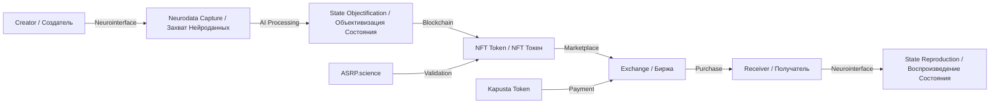
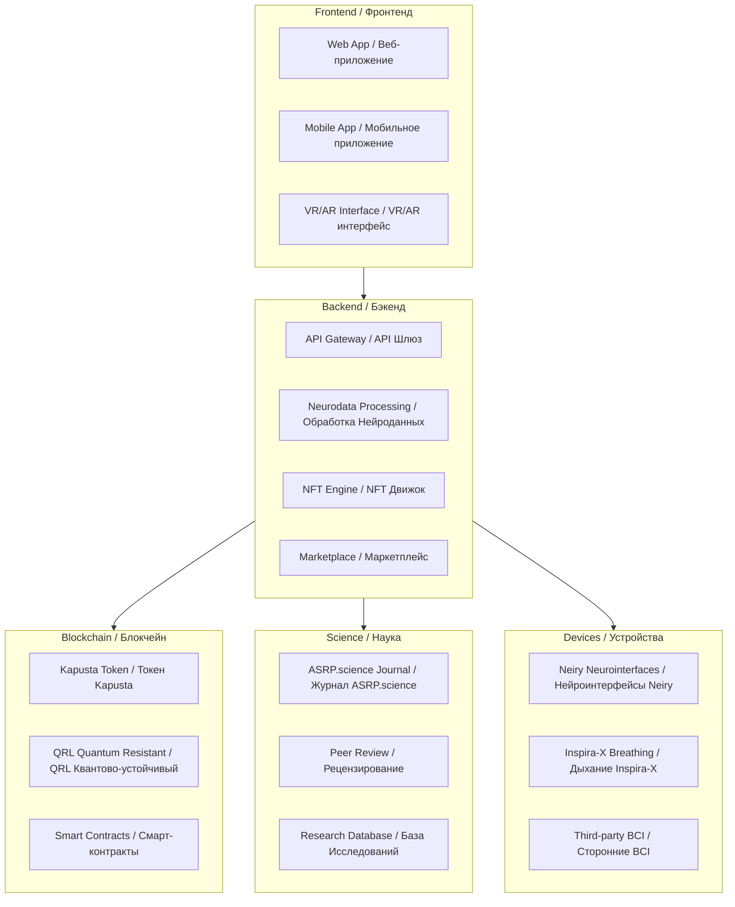

# 🧠 ASRP.art Platform - Technical Specification
# 🧠 Платформа ASRP.art - Техническое Задание

**Repository / Репозиторий:** ASRP.art-Platform  
**Organization / Организация:** AdvancedScientificResearchProjects  
**Version / Версия:** 1.0.0  
**Status / Статус:** Initial Development / Начальная разработка  
**Date / Дата:** 23 March 2026  

---

## 📋 TABLE OF CONTENTS / СОДЕРЖАНИЕ

1. [Executive Summary / Краткое Описание](#1-executive-summary--краткое-описание)
2. [Vision & Mission / Видение и Миссия](#2-vision--mission--видение-и-миссия)
3. [Core Concept / Основная Концепция](#3-core-concept--основная-концепция)
4. [System Architecture / Архитектура Системы](#4-system-architecture--архитектура-системы)
5. [Roles & Permissions / Роли и Разрешения](#5-roles--permissions--роли-и-разрешения)
6. [Technical Stack / Технический Стек](#6-technical-stack--технический-стек)
7. [Neurointerface Integration / Интеграция Нейроинтерфейсов](#7-neurointerface-integration--интеграция-нейроинтерфейсов)
8. [Blockchain & Kapusta Cryptocurrency / Блокчейн и Криптовалюта Kapusta](#8-blockchain--kapusta-cryptocurrency--блокчейн-и-криптовалюта-kapusta)
9. [Art Market Integration / Интеграция с Арт-Рынком](#9-art-market-integration--интеграция-с-арт-рынком)
10. [Scientific Validation / Научная Валидация](#10-scientific-validation--научная-валидация)
11. [Development Roadmap / Дорожная Карта Разработки](#11-development-roadmap--дорожная-карта-разработки)
12. [Issues & Tasks / Задачи и Задания](#12-issues--tasks--задачи-и-задания)

---

## 1. EXECUTIVE SUMMARY / КРАТКОЕ ОПИСАНИЕ

### 🎯 Project Overview / Обзор Проекта

**ASRP.art** is a revolutionary platform that objectifies consciousness states through art and creates a new market where consciousness states (not gold or metals) become the foundation of currency.

**ASRP.art** — это революционная платформа, которая объективизирует состояния сознания через искусство и создаёт новый рынок, где состояния сознания (а не золото или металлы) становятся основой валюты.

### 🔥 Key Innovation / Ключевая Инновация

| Traditional Market / Традиционный Рынок | ASRP.art Market / Рынок ASRP.art |
|----------------------------------------|----------------------------------|
| Gold/Metals backed / Обеспечено золотом/металлами | **Consciousness States backed / Обеспечено состояниями сознания** |
| Physical art objects / Физические объекты искусства | **Neurodata-embedded art / Искусство с нейроданными** |
| Subjective valuation / Субъективная оценка | **Objective neurophysiological valuation / Объективная нейрофизиологическая оценка** |
| Human-only market / Только для людей | **Multi-civilization exchange / Обмен между цивилизациями** |

### 🌍 Strategic Purpose / Стратегическая Цель

**Create a bridge for technology-art exchange with other civilizations (including UAP/extraterrestrial representatives).**

**Создать мост для обмена технологии-искусство с другими цивилизациями (включая представителей UAP/внеземных).**

**Why they want our art / Почему они хотят наше искусство:**
- Human consciousness states are **unique and non-reproducible** / Состояния человеческого сознания **уникальны и невоспроизводимы**
- Art created in **altered states** (lucid dreams, meditation, transcendental states) contains **irreplaceable cognitive patterns** / Искусство, созданное в **изменённых состояниях** (осознанные сны, медитация, трансцендентальные состояния), содержит **незаменимые когнитивные паттерны**
- For technologically advanced civilizations, **consciousness diversity** is more valuable than material resources / Для технологически развитых цивилизаций **разнообразие сознания** ценнее материальных ресурсов

---

## 2. VISION & MISSION / ВИДЕНИЕ И МИССИЯ

### 👁️ Vision / Видение

**A global consciousness state exchange where art becomes the universal currency for inter-civilization trade.**

**Глобальная биржа состояний сознания, где искусство становится универсальной валютой для межцивилизационной торговли.**

### 🎯 Mission / Миссия

| Component / Компонент | Description / Описание |
|----------------------|----------------------|
| **Objectification / Объективизация** | Record consciousness states in material/digital carriers / Запись состояний сознания в материальные/цифровые носители |
| **Valuation / Оценка** | Objective neurophysiological art evaluation / Объективная нейрофизиологическая оценка искусства |
| **Exchange / Обмен** | Trade consciousness states for technologies / Торговля состояниями сознания за технологии |
| **Validation / Валидация** | Scientific publication and peer review / Научная публикация и рецензирование |

---

## 3. CORE CONCEPT / ОСНОВНАЯ КОНЦЕПЦИЯ

### 🧠 Consciousness State Transfer / Передача Состояния Сознания

### 📊 State Capture Process / Процесс Захвата Состояния

| Step / Шаг | Action / Действие | Technology / Технология |
|-----------|------------------|------------------------|
| 1 | Creator enters altered state / Создатель входит в изменённое состояние | Meditation, Lucid Dream, Transcendental / Медитация, ОС, Трансцендентальное |
| 2 | Neurodata recording / Запись нейроданных | EEG, MEG, fMRI, Inspira-X, Neiry |
| 3 | Biometric capture / Захват биометрии | HRV, Breathing, GSR / ВСР, Дыхание, КГР |
| 4 | AI pattern analysis / AI анализ паттернов | Deep Learning, Neural Networks / Глубокое обучение, Нейросети |
| 5 | NFT minting / Минтинг NFT | Quantum Resistant Ledger / QRL |
| 6 | Scientific validation / Научная валидация | ASRP.science publication / Публикация в ASRP.science |

---

## 4. SYSTEM ARCHITECTURE / АРХИТЕКТУРА СИСТЕМЫ

### 🏗️ High-Level Architecture / Архитектура Высокого Уровня

---

## 5. ROLES & PERMISSIONS / РОЛИ И РАЗРЕШЕНИЯ

### 👥 System Roles / Роли в Системе

| Role / Роль | Responsibilities / Обязанности | Permissions / Разрешения |
|------------|-------------------------------|-------------------------|
| **Creator / Создатель** | Creates art with recorded consciousness states / Создаёт искусство с записанными состояниями сознания | Mint NFT, Upload neurodata, Publish to marketplace |
| **Censor / Цензор** | Validates content appropriateness / Проверяет уместность контента | Approve/reject content, Flag violations |
| **Critic / Критик** | Provides expert art evaluation / Даёт экспертную оценку искусства | Write reviews, Rate artworks, Influence valuation |
| **Reader / Читатель** | Experiences art, neurofeedback / Воспринимает искусство, нейрофидбек | Purchase NFT, Submit neurofeedback reactions |
| **Administrator / Администратор** | Platform management / Управление платформой | Full system access, User management |
| **Editor / Редактор** | Content curation, publication / Курация контента, публикация | Edit content, Manage publications |
| **Scientific Reviewer / Научный Рецензент** | Validates neurodata, research / Валидирует нейроданные, исследования | Access research data, Publish to ASRP.science |

---

## 6. TECHNICAL STACK / ТЕХНИЧЕСКИЙ СТЕК

| Layer / Слой | Technology / Технология | Purpose / Назначение |
|-------------|------------------------|---------------------|
| **Frontend** | React, Three.js, WebXR | Web/VR/AR interface / Веб/VR/AR интерфейс |
| **Backend** | Node.js, Python, FastAPI | API, Processing / API, Обработка |
| **Database** | PostgreSQL, MongoDB, IPFS | Data storage / Хранение данных |
| **AI/ML** | PyTorch, TensorFlow | Neural pattern analysis / Анализ нейропаттернов |
| **Blockchain** | QRL (Quantum Resistant Ledger) | NFT, Kapusta token / NFT, токен Kapusta |
| **Neurointerfaces** | Neiry SDK, OpenBCI, Custom | Brain data capture / Захват данных мозга |
| **DevOps** | Docker, Kubernetes, AWS | Infrastructure / Инфраструктура |

---

## 7. NEUROINTERFACE INTEGRATION / ИНТЕГРАЦИЯ НЕЙРОИНТЕРФЕЙСОВ

### 🧠 Supported Devices / Поддерживаемые Устройства

| Device / Устройство | Type / Тип | Channels / Каналы | Status / Статус |
|--------------------|-----------|------------------|-----------------|
| **Neiry Headband Pro** | EEG | 4 (O1, O2, T3, T4) | ✅ Native |
| **Neiry Headphones Pro** | EEG + Audio | 4 (A1, A2, C3, C4) | ✅ Native |
| **Inspira-X** | Breathing | 1 (Respiration rate) | ✅ Native |
| **Muse 2** | EEG | 4 (TP9, AF7, AF8, TP10) | 🔄 Planned |
| **Emotiv EPOC X** | EEG | 14 | 🔄 Planned |
| **OpenBCI** | EEG | 8-32 | 🔄 Planned |

---

## 8. BLOCKCHAIN & KAPUSTA CRYPTOCURRENCY / БЛОКЧЕЙН И КРИПТОВАЛЮТА KAPUSTA

### 🪙 Kapusta Token Economics / Экономика Токена Kapusta

| Parameter / Параметр | Value / Значение |
|---------------------|-----------------|
| **Token Name** | Kapusta / Капуста |
| **Symbol** | KAPUSTA |
| **Blockchain** | Quantum Resistant Ledger (QRL) |
| **Total Supply** | 1,000,000,000 KAPUSTA |
| **Backing** | Consciousness states in art |
| **Use Case** | Art purchase, Technology exchange, Research funding |

---

## 9. ART MARKET INTEGRATION / ИНТЕГРАЦИЯ С АРТ-РЫНКОМ

### 🏛️ Market Partners / Партнёры Рынка

| Market / Рынок | Platform / Платформа | Integration / Интеграция |
|---------------|---------------------|-------------------------|
| **Classic Auction** | Christie's, Sotheby's, Phillips | API for pricing data |
| **Online Art** | Artsy, Saatchi Art, Artnet | Listing integration |
| **NFT / Digital Art** | OpenSea, SuperRare, Foundation | NFT minting & trading |
| **Generative Art** | Art Blocks, Async Art | Consciousness-state generative |

---

## 10. SCIENTIFIC VALIDATION / НАУЧНАЯ ВАЛИДАЦИЯ

### 🔬 ASRP.science Integration

**Every artwork must be scientifically validated and published.**

**Каждое произведение искусства должно быть научно валидировано и опубликовано.**

---

## 11. DEVELOPMENT ROADMAP / ДОРОЖНАЯ КАРТА РАЗРАБОТКИ

| Phase / Фаза | Timeline / Сроки | Deliverables / Результаты |
|-------------|-----------------|-------------------------|
| **Phase 1: Foundation** | Q2-Q3 2026 | Core Platform, Neurointerface SDK, Kapusta Token |
| **Phase 2: Integration** | Q4 2026 - Q1 2027 | Art Market API, ASRP.science, Censor System |
| **Phase 3: Expansion** | Q2-Q4 2027 | Multi-Civilization Protocol, VR/AR, Global Launch |

---

## 12. ISSUES & TASKS / ЗАДАЧИ И ЗАДАНИЯ

### 👨‍💼 CTO Tasks

**Issue:** `#1 - Platform Architecture & Technical Leadership`

- [ ] Define system architecture
- [ ] Select technology stack
- [ ] Lead development team
- [ ] Ensure scalability
- [ ] Security audit

---

### 👨‍⚕️ CBE Tasks

**Issue:** `#2 - Neurointerface & Biometric Integration`

- [ ] Neiry SDK integration
- [ ] Inspira-X breathing data
- [ ] Censor cognitive enhancement tools
- [ ] Neurodata validation protocols
- [ ] Biometric signal quality assurance

---

### 🔌 Embedded Engineers Tasks

**Issue:** `#3 - Hardware Integration & Device Drivers`

- [ ] Neiry device driver
- [ ] Inspira-X UART/SPI interface
- [ ] Real-time data streaming
- [ ] Low-power optimization
- [ ] Multi-device synchronization

---

### 🔍 Reverse Engineering Engineers Tasks

**Issue:** `#4 - Third-Party Neurointerface Reverse Engineering`

- [ ] Muse 2 protocol analysis
- [ ] Emotiv EPOC X communication
- [ ] OpenBCI firmware modification
- [ ] Proprietary SDK documentation
- [ ] Signal quality comparison

---

## 📎 APPENDICES / ПРИЛОЖЕНИЯ

### A. Related Repositories / Связанные Репозитории

| Repository | Purpose | Link |
|-----------|---------|------|
| **Kazpatent_Axionetic_Sensing_Reactions_Platform_in_Art_Patent** | Patent documentation | [View](https://github.com/denisbanchenko/Kazpatent_Axionetic_Sensing_Reactions_Platform_in_Art_Patent) |
| **Hyperbolic_Field_Emitter_Programs** | Related technology | [View](https://github.com/AdvancedScientificResearchProjects/Hyperbolic_Field_Emitter_Programs) |

### B. Scientific References / Научные Ссылки

1. [Banchenko Market Concept - ResearchGate](https://www.researchgate.net/publication/378492156_FUNDING_FOR_FUNDAMENTAL_SCIENCE_RESEARCH_BASED_ON_BLOCKCHAIN_TECHNOLOGIES_BANCHENKO_MARKET_LUCID_DREAMS_AND_OTHER_TRNSCENDENTAL_STATES_OF_CONSCIOUSNESS_MARKET)
2. [GMS & GFS - ResearchGate](https://www.researchgate.net/publication/388438082_Technological_Transformations_Formation_of_GMS_Global_Mental_System_and_GFS_Global_Forecasting_System)
3. [Neurointerface Review - ResearchGate](https://www.researchgate.net/publication/396126506_A_Technological_Review_of_BCI_Systems_and_Neural_Interfaces)

### C. Art Market References / Ссылки на Арт-Рынок

| Market | Platform | Link |
|--------|----------|------|
| **Christie's** | Auction | https://www.christies.com |
| **Sotheby's** | Auction | https://www.sothebys.com |
| **OpenSea** | NFT | https://opensea.io |
| **SuperRare** | NFT | https://superrare.com |
| **Art Blocks** | Generative | https://artblocks.io |

---

## 📞 CONTACT / КОНТАКТЫ

**Organization:** Advanced Scientific Research Projects (ASRP)  
**Website:** https://asrp.tech  
**Email:** denisbanchenko@asrp.tech  
**GitHub:** https://github.com/AdvancedScientificResearchProjects  

---

**Last Updated:** 23 March 2026  
**Version:** 1.0.0  
**Status:** Initial Release

---

*This document is part of the ASRP.art Platform ecosystem. All rights reserved.*
