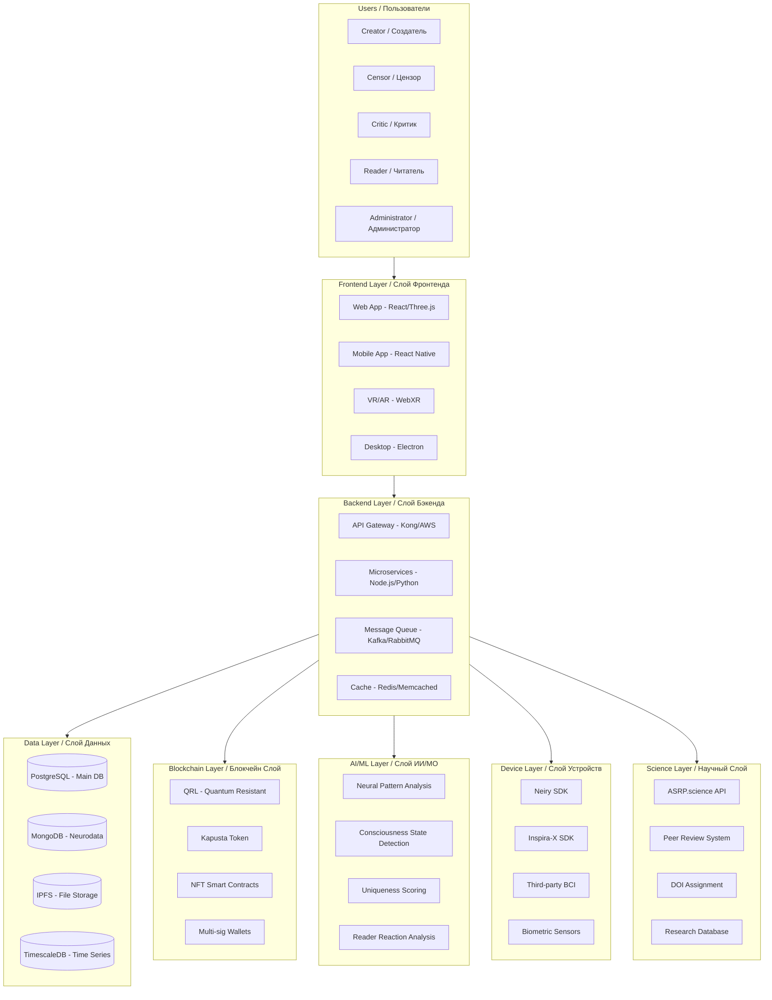
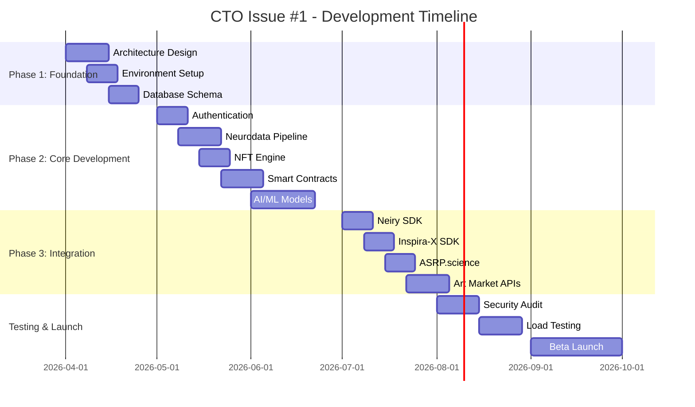

# 🎯 ISSUE #1: PLATFORM ARCHITECTURE & TECHNICAL LEADERSHIP
# 🎯 ЗАДАЧА #1: АРХИТЕКТУРА ПЛАТФОРМЫ И ТЕХНИЧЕСКОЕ РУКОВОДСТВО

**Repository:** Axionetic_Sensing_Reactions_Platform_in_Art  
**Issue Number:** #1  
**Priority:** 🔴 CRITICAL  
**Status:** ⏳ OPEN  
**Assigned To:** CTO (Chief Technology Officer)  
**Sprint:** Foundation (Q2-Q3 2026)  

---

## 📋 EXECUTIVE SUMMARY / КРАТКОЕ ОПИСАНИЕ

**Mission / Миссия:**
Design and implement the complete technical architecture for the Axionetic Sensing Reactions Platform in Art - a consciousness state objectification and inter-civilization art/technology exchange system.

**Спроектировать и реализовать полную техническую архитектуру для Платформы Аксонетического Сенсорного Реакционного Искусства - системы объективизации состояний сознания и межцивилизационного обмена искусство/технологии.**

---

## 🎯 OBJECTIVES / ЦЕЛИ

### Primary Objectives / Основные Цели

| ID | Objective / Цель | Priority / Приоритет | Status / Статус |
|----|-----------------|---------------------|----------------|
| **OBJ-001** | Define system architecture / Определить архитектуру системы | 🔴 Critical | ⏳ Todo |
| **OBJ-002** | Select technology stack / Выбрать стек технологий | 🔴 Critical | ⏳ Todo |
| **OBJ-003** | Lead development team / Руководить командой разработки | 🔴 Critical | ⏳ Todo |
| **OBJ-004** | Ensure scalability / Обеспечить масштабируемость | 🔴 Critical | ⏳ Todo |
| **OBJ-005** | Security audit & implementation / Аудит и реализация безопасности | 🔴 Critical | ⏳ Todo |
| **OBJ-006** | Integration with ASRP ecosystem / Интеграция с экосистемой ASRP | 🔴 Critical | ⏳ Todo |

---

## 🏗️ ARCHITECTURE REQUIREMENTS / ТРЕБОВАНИЯ К АРХИТЕКТУРЕ

### System Architecture Overview / Обзор Архитектуры Системы

---

## 📊 TECHNICAL SPECIFICATIONS / ТЕХНИЧЕСКИЕ СПЕЦИФИКАЦИИ

### 1. Performance Requirements / Требования к Производительности

| Metric / Метрика | Requirement / Требование | Measurement / Измерение |
|-----------------|-------------------------|------------------------|
| **API Response Time** | < 100ms (p95) | AWS CloudWatch |
| **Neurodata Processing** | < 1 second latency | Custom metrics |
| **NFT Minting Time** | < 30 seconds | Blockchain explorer |
| **Concurrent Users** | 100,000+ | Load testing |
| **Data Throughput** | 10,000 requests/sec | Stress testing |
| **Uptime SLA** | 99.99% | Monitoring tools |

### 2. Security Requirements / Требования к Безопасности

| Security Control / Контроль Безопасности | Implementation / Реализация | Priority |
|-----------------------------------------|----------------------------|----------|
| **Authentication** | OAuth 2.0 + JWT + MFA | 🔴 Critical |
| **Authorization** | RBAC + ABAC | 🔴 Critical |
| **Data Encryption** | AES-256 at rest, TLS 1.3 in transit | 🔴 Critical |
| **Quantum Resistance** | QRL blockchain, Post-quantum cryptography | 🔴 Critical |
| **Neurodata Privacy** | HIPAA/GDPR compliance, Anonymization | 🔴 Critical |
| **Smart Contract Audit** | Formal verification, Third-party audit | 🔴 Critical |

### 3. Scalability Requirements / Требования к Масштабируемости

| Component / Компонент | Scaling Strategy / Стратегия Масштабирования |
|----------------------|--------------------------------------------|
| **Frontend** | CDN, Edge computing, Static site generation |
| **Backend** | Horizontal scaling, Kubernetes, Auto-scaling |
| **Database** | Read replicas, Sharding, Connection pooling |
| **Blockchain** | Layer-2 solutions, Sidechains |
| **AI/ML** | GPU clusters, Model optimization, Batch processing |

---

## 🔧 DEVELOPMENT TASKS / ЗАДАЧИ РАЗРАБОТКИ

### Phase 1: Foundation (Weeks 1-4)

| Task ID | Task / Задача | Priority | Estimate | Status |
|---------|--------------|----------|----------|--------|
| **ARCH-001** | Create architecture decision records (ADRs) / Создать записи архитектурных решений | 🔴 Critical | 3 days | ⏳ Todo |
| **ARCH-002** | Set up development environment / Настроить среду разработки | 🔴 Critical | 2 days | ⏳ Todo |
| **ARCH-003** | Define API specifications (OpenAPI/Swagger) / Определить спецификации API | 🔴 Critical | 3 days | ⏳ Todo |
| **ARCH-004** | Set up CI/CD pipelines / Настроить CI/CD пайплайны | 🔴 Critical | 3 days | ⏳ Todo |
| **ARCH-005** | Create database schemas / Создать схемы баз данных | 🔴 Critical | 4 days | ⏳ Todo |
| **ARCH-006** | Set up monitoring & logging / Настроить мониторинг и логирование | 🟡 High | 3 days | ⏳ Todo |

### Phase 2: Core Development (Weeks 5-12)

| Task ID | Task / Задача | Priority | Estimate | Status |
|---------|--------------|----------|----------|--------|
| **CORE-001** | Implement user authentication & authorization / Реализовать аутентификацию и авторизацию | 🔴 Critical | 5 days | ⏳ Todo |
| **CORE-002** | Build neurodata ingestion pipeline / Построить пайплайн приёма нейроданных | 🔴 Critical | 7 days | ⏳ Todo |
| **CORE-003** | Implement NFT minting engine / Реализовать движок минтинга NFT | 🔴 Critical | 5 days | ⏳ Todo |
| **CORE-004** | Build marketplace smart contracts / Построить смарт-контракты маркетплейса | 🔴 Critical | 7 days | ⏳ Todo |
| **CORE-005** | Implement AI pattern analysis / Реализовать AI анализ паттернов | 🔴 Critical | 10 days | ⏳ Todo |
| **CORE-006** | Build censor evaluation interface / Построить интерфейс оценки цензора | 🟡 High | 5 days | ⏳ Todo |

### Phase 3: Integration (Weeks 13-16)

| Task ID | Task / Задача | Priority | Estimate | Status |
|---------|--------------|----------|----------|--------|
| **INT-001** | Integrate Neiry SDK / Интегрировать Neiry SDK | 🔴 Critical | 5 days | ⏳ Todo |
| **INT-002** | Integrate Inspira-X SDK / Интегрировать Inspira-X SDK | 🔴 Critical | 5 days | ⏳ Todo |
| **INT-003** | Integrate ASRP.science API / Интегрировать ASRP.science API | 🟡 High | 4 days | ⏳ Todo |
| **INT-004** | Integrate art market APIs (Christie's, Sotheby's) / Интегрировать API арт-рынка | 🟡 High | 5 days | ⏳ Todo |
| **INT-005** | Integrate NFT marketplaces (OpenSea, SuperRare) / Интегрировать NFT маркетплейсы | 🟡 High | 5 days | ⏳ Todo |

---

## 📈 SUCCESS METRICS / МЕТРИКИ УСПЕХА

| Metric / Метрика | Target / Цель | Measurement Method / Метод Измерения |
|-----------------|--------------|-------------------------------------|
| **System Uptime** | 99.99% | Monitoring tools (Prometheus, Grafana) |
| **API Response Time** | < 100ms (p95) | APM tools (New Relic, DataDog) |
| **Code Coverage** | > 80% | Testing tools (Jest, Pytest) |
| **Security Audit Score** | > 95% | Third-party audit (Cure53, Trail of Bits) |
| **Developer Velocity** | 2x improvement | DORA metrics |
| **User Satisfaction** | > 4.5/5 | User surveys, NPS |

---

## 🔗 DEPENDENCIES / ЗАВИСИМОСТИ

### Internal Dependencies / Внутренние Зависимости

| Dependency / Зависимость | Owner / Владелец | Status / Статус |
|-------------------------|-----------------|----------------|
| **CBE: Neurointerface Integration** | CBE | ⏳ In Progress |
| **Blockchain: Kapusta Token** | Blockchain Team | ⏳ Todo |
| **AI/ML: Pattern Analysis Models** | AI Team | ⏳ Todo |
| **Science: ASRP.science Integration** | Science Team | ⏳ Todo |

### External Dependencies / Внешние Зависимости

| Dependency / Зависимость | Vendor / Поставщик | Risk Level |
|-------------------------|-------------------|------------|
| **Neiry SDK** | Neiry Ltd | 🟡 Medium |
| **Inspira-X API** | Inspira-X | 🟡 Medium |
| **QRL Blockchain** | QRL Foundation | 🟢 Low |
| **AWS Infrastructure** | Amazon | 🟢 Low |

---

## 📚 DOCUMENTATION REQUIREMENTS / ТРЕБОВАНИЯ К ДОКУМЕНТАЦИИ

### Required Documentation / Требуемая Документация

| Document / Документ | Format / Формат | Deadline / Дедлайн |
|--------------------|----------------|-------------------|
| **Architecture Decision Records** | Markdown | Week 2 |
| **API Documentation** | OpenAPI/Swagger | Week 4 |
| **Database Schema** | ERD + SQL | Week 3 |
| **Security Policy** | Markdown | Week 4 |
| **Deployment Guide** | Markdown | Week 8 |
| **User Manual** | Markdown + Video | Week 12 |

---

## 🎓 TEAM STRUCTURE / СТРУКТУРА КОМАНДЫ

### Development Team / Команда Разработки

| Role / Роль | Responsibilities / Обязанности | FTE |
|------------|-------------------------------|-----|
| **CTO** | Technical leadership, Architecture | 1.0 |
| **Tech Lead** | Code review, Sprint planning | 1.0 |
| **Backend Engineers** | API, Microservices, Database | 3.0 |
| **Frontend Engineers** | Web, Mobile, VR/AR | 2.0 |
| **DevOps Engineers** | CI/CD, Infrastructure, Monitoring | 2.0 |
| **Security Engineer** | Security audit, Compliance | 1.0 |
| **QA Engineers** | Testing, Quality assurance | 2.0 |

---

## 📅 TIMELINE / ВРЕМЕННАЯ ШКАЛА

---

## 🔗 RELATED ISSUES / СВЯЗАННЫЕ ЗАДАЧИ

| Issue # | Title / Название | Owner / Владелец |
|---------|-----------------|-----------------|
| **#2** | Neurointerface & Biometric Integration | CBE |
| **#3** | Hardware Integration & Device Drivers | Embedded Team |
| **#4** | Third-Party Neurointerface Reverse Engineering | Reverse Engineering |
| **#5** | User Interface & Experience | Frontend Team |
| **#6** | API & Infrastructure | Backend Team |
| **#7** | Neural Pattern Analysis | AI/ML Team |
| **#8** | Kapusta Token & NFT | Blockchain Team |
| **#9** | ASRP.science Integration | Science Team |

---

## 📞 CONTACT / КОНТАКТЫ

**CTO:** [TBD]  
**Email:** cto@asrp.tech  
**Slack:** #cto-office  
**GitHub:** @ASRP-CTO  

---

**Created:** 23 March 2026  
**Last Updated:** 23 March 2026  
**Version:** 1.0.0  
**Status:** ⏳ OPEN

---

*This issue is part of the Axionetic Sensing Reactions Platform in Art development ecosystem. All rights reserved.*
