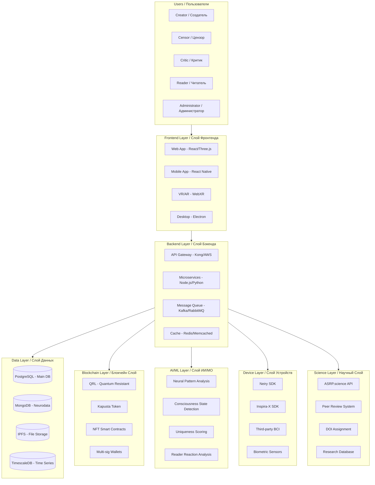
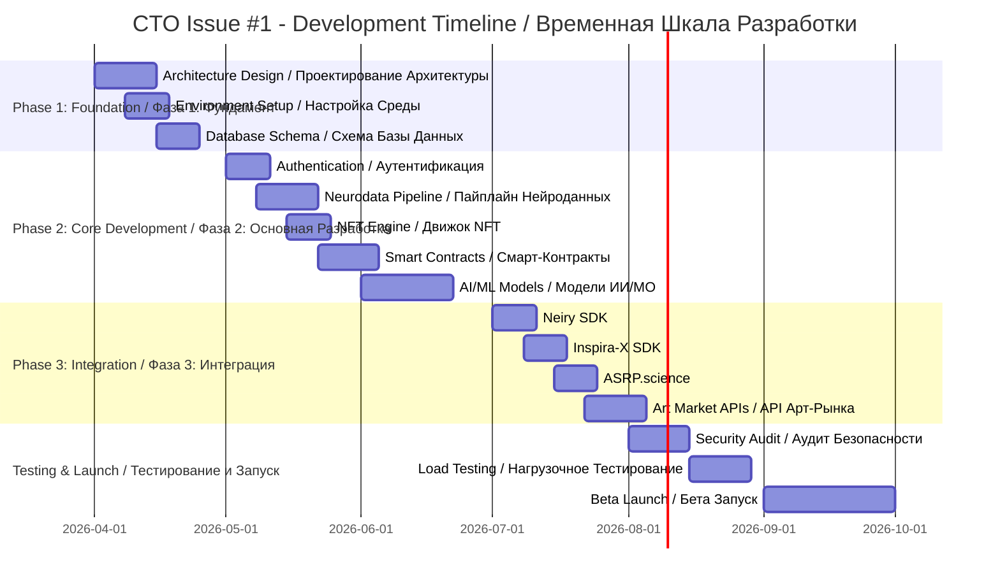

# 🎯 ISSUE #1: PLATFORM ARCHITECTURE & TECHNICAL LEADERSHIP / АРХИТЕКТУРА ПЛАТФОРМЫ И ТЕХНИЧЕСКОЕ РУКОВОДСТВО _EN_RU

**Repository / Репозиторий:** Axionetic_Sensing_Reactions_Platform_in_Art (ASRP.art / ПНИР.искусство)  
**Issue Number / Номер Задачи:** #1  
**Priority / Приоритет:** 🔴 CRITICAL / КРИТИЧНО  
**Status / Статус:** ⏳ OPEN / ОТКРЫТО  
**Assigned To / Назначено:** CTO (Chief Technology Officer / Технический Директор)  
**Sprint / Спринт:** Foundation (Q2-Q3 2026 / Фундамент)  

---

## 📋 EXECUTIVE SUMMARY / КРАТКОЕ ОПИСАНИЕ

**Mission / Миссия:**
Design and implement the complete technical architecture for the Axionetic Sensing Reactions Platform in Art (ASRP.art / ПНИР.искусство) - a consciousness state objectification and inter-civilization art/technology exchange system.

**Спроектировать и реализовать полную техническую архитектуру для Платформы Аксонетического Сенсорного Реакционного Искусства (ASRP.art / ПНИР.искусство) - системы объективизации состояний сознания и межцивилизационного обмена искусство/технологии.**

**Why This Matters / Почему Это Важно:**
This platform enables not only inter-civilization exchange but also human-to-human consciousness state trading. People can buy/sell art with embedded consciousness states from other people, creating a completely new market category.

**Эта платформа позволяет не только межцивилизационный обмен, но и торговлю состояниями сознания между людьми. Люди могут покупать/продавать искусство с встроенными состояниями сознания от других людей, создавая совершенно новую категорию рынка.**

---

## 🎯 OBJECTIVES / ЦЕЛИ

### Primary Objectives / Основные Цели

| ID | Objective / Цель | Priority / Приоритет | Status / Статус |
|----|-----------------|---------------------|----------------|
| **OBJ-001** | Define system architecture / Определить архитектуру системы | 🔴 Critical / Критично | ⏳ Todo |
| **OBJ-002** | Select technology stack / Выбрать стек технологий | 🔴 Critical / Критично | ⏳ Todo |
| **OBJ-003** | Lead development team / Руководить командой разработки | 🔴 Critical / Критично | ⏳ Todo |
| **OBJ-004** | Ensure scalability / Обеспечить масштабируемость | 🔴 Critical / Критично | ⏳ Todo |
| **OBJ-005** | Security audit & implementation / Аудит и реализация безопасности | 🔴 Critical / Критично | ⏳ Todo |
| **OBJ-006** | Integration with ASRP ecosystem / Интеграция с экосистемой ASRP | 🔴 Critical / Критично | ⏳ Todo |

---

## 🏗️ ARCHITECTURE REQUIREMENTS / ТРЕБОВАНИЯ К АРХИТЕКТУРЕ

### System Architecture Overview / Обзор Архитектуры Системы

---

## 📊 TECHNICAL SPECIFICATIONS / ТЕХНИЧЕСКИЕ СПЕЦИФИКАЦИИ

### 1. Performance Requirements / Требования к Производительности

| Metric / Метрика | Requirement / Требование | Measurement / Измерение |
|-----------------|-------------------------|------------------------|
| **API Response Time** | < 100ms (p95) | AWS CloudWatch |
| **Neurodata Processing** | < 1 second latency / < 1 секунда задержка | Custom metrics |
| **NFT Minting Time** | < 30 seconds / < 30 секунд | Blockchain explorer |
| **Concurrent Users** | 100,000+ / 100,000+ пользователей | Load testing |
| **Data Throughput** | 10,000 requests/sec / 10,000 запросов/сек | Stress testing |
| **Uptime SLA** | 99.99% | Monitoring tools |

### 2. Security Requirements / Требования к Безопасности

| Security Control / Контроль Безопасности | Implementation / Реализация | Priority |
|-----------------------------------------|----------------------------|----------|
| **Authentication / Аутентификация** | OAuth 2.0 + JWT + MFA | 🔴 Critical / Критично |
| **Authorization / Авторизация** | RBAC + ABAC | 🔴 Critical / Критично |
| **Data Encryption / Шифрование Данных** | AES-256 at rest, TLS 1.3 in transit | 🔴 Critical / Критично |
| **Quantum Resistance / Квантовая Устойчивость** | QRL blockchain, Post-quantum cryptography | 🔴 Critical / Критично |
| **Neurodata Privacy / Приватность Нейроданных** | HIPAA/GDPR compliance, Anonymization | 🔴 Critical / Критично |
| **Smart Contract Audit / Аудит Смарт-Контрактов** | Formal verification, Third-party audit | 🔴 Critical / Критично |

### 3. Scalability Requirements / Требования к Масштабируемости

| Component / Компонент | Scaling Strategy / Стратегия Масштабирования |
|----------------------|--------------------------------------------|
| **Frontend / Фронтенд** | CDN, Edge computing, Static site generation |
| **Backend / Бэкенд** | Horizontal scaling, Kubernetes, Auto-scaling |
| **Database / База Данных** | Read replicas, Sharding, Connection pooling |
| **Blockchain / Блокчейн** | Layer-2 solutions, Sidechains |
| **AI/ML / ИИ/МО** | GPU clusters, Model optimization, Batch processing |

---

## 🔧 DEVELOPMENT TASKS / ЗАДАЧИ РАЗРАБОТКИ

### Phase 1: Foundation / Фаза 1: Фундамент (Weeks 1-4 / Недели 1-4)

| Task ID | Task / Задача | Priority / Приоритет | Estimate / Оценка | Status / Статус |
|---------|--------------|----------|----------|--------|
| **ARCH-001** | Create architecture decision records (ADRs) / Создать записи архитектурных решений | 🔴 Critical / Критично | 3 days / 3 дня | ⏳ Todo |
| **ARCH-002** | Set up development environment / Настроить среду разработки | 🔴 Critical / Критично | 2 days / 2 дня | ⏳ Todo |
| **ARCH-003** | Define API specifications (OpenAPI/Swagger) / Определить спецификации API | 🔴 Critical / Критично | 3 days / 3 дня | ⏳ Todo |
| **ARCH-004** | Set up CI/CD pipelines / Настроить CI/CD пайплайны | 🔴 Critical / Критично | 3 days / 3 дня | ⏳ Todo |
| **ARCH-005** | Create database schemas / Создать схемы баз данных | 🔴 Critical / Критично | 4 days / 4 дня | ⏳ Todo |
| **ARCH-006** | Set up monitoring & logging / Настроить мониторинг и логирование | 🟡 High / Высокий | 3 days / 3 дня | ⏳ Todo |

### Phase 2: Core Development / Фаза 2: Основная Разработка (Weeks 5-12 / Недели 5-12)

| Task ID | Task / Задача | Priority / Приоритет | Estimate / Оценка | Status / Статус |
|---------|--------------|----------|----------|--------|
| **CORE-001** | Implement user authentication & authorization / Реализовать аутентификацию и авторизацию | 🔴 Critical / Критично | 5 days / 5 дней | ⏳ Todo |
| **CORE-002** | Build neurodata ingestion pipeline / Построить пайплайн приёма нейроданных | 🔴 Critical / Критично | 7 days / 7 дней | ⏳ Todo |
| **CORE-003** | Implement NFT minting engine / Реализовать движок минтинга NFT | 🔴 Critical / Критично | 5 days / 5 дней | ⏳ Todo |
| **CORE-004** | Build marketplace smart contracts / Построить смарт-контракты маркетплейса | 🔴 Critical / Критично | 7 days / 7 дней | ⏳ Todo |
| **CORE-005** | Implement AI pattern analysis / Реализовать AI анализ паттернов | 🔴 Critical / Критично | 10 days / 10 дней | ⏳ Todo |
| **CORE-006** | Build censor evaluation interface / Построить интерфейс оценки цензора | 🟡 High / Высокий | 5 days / 5 дней | ⏳ Todo |

### Phase 3: Integration / Фаза 3: Интеграция (Weeks 13-16 / Недели 13-16)

| Task ID | Task / Задача | Priority / Приоритет | Estimate / Оценка | Status / Статус |
|---------|--------------|----------|----------|--------|
| **INT-001** | Integrate Neiry SDK / Интегрировать Neiry SDK | 🔴 Critical / Критично | 5 days / 5 дней | ⏳ Todo |
| **INT-002** | Integrate Inspira-X SDK / Интегрировать Inspira-X SDK | 🔴 Critical / Критично | 5 days / 5 дней | ⏳ Todo |
| **INT-003** | Integrate ASRP.science API / Интегрировать ASRP.science API | 🟡 High / Высокий | 4 days / 4 дня | ⏳ Todo |
| **INT-004** | Integrate art market APIs (Christie's, Sotheby's) / Интегрировать API арт-рынка | 🟡 High / Высокий | 5 days / 5 дней | ⏳ Todo |
| **INT-005** | Integrate NFT marketplaces (OpenSea, SuperRare) / Интегрировать NFT маркетплейсы | 🟡 High / Высокий | 5 days / 5 дней | ⏳ Todo |

---

## 📈 SUCCESS METRICS / МЕТРИКИ УСПЕХА

| Metric / Метрика | Target / Цель | Measurement Method / Метод Измерения |
|-----------------|--------------|-------------------------------------|
| **System Uptime / Время Работы Системы** | 99.99% | Monitoring tools (Prometheus, Grafana) |
| **API Response Time / Время Ответа API** | < 100ms (p95) | APM tools (New Relic, DataDog) |
| **Code Coverage / Покрытие Кода** | > 80% | Testing tools (Jest, Pytest) |
| **Security Audit Score / Оценка Аудита Безопасности** | > 95% | Third-party audit (Cure53, Trail of Bits) |
| **Developer Velocity / Скорость Разработки** | 2x improvement / 2x улучшение | DORA metrics |
| **User Satisfaction / Удовлетворённость Пользователей** | > 4.5/5 | User surveys, NPS |

---

## 🔗 DEPENDENCIES / ЗАВИСИМОСТИ

### Internal Dependencies / Внутренние Зависимости

| Dependency / Зависимость | Owner / Владелец | Status / Статус |
|-------------------------|-----------------|----------------|
| **CBE: Neurointerface Integration / Нейроинтерфейсы** | CBE | ⏳ In Progress |
| **Blockchain: Kapusta Token / Токен Капуста** | Blockchain Team | ⏳ Todo |
| **AI/ML: Pattern Analysis Models / Модели Анализа Паттернов** | AI Team | ⏳ Todo |
| **Science: ASRP.science Integration / Интеграция ASRP.science** | Science Team | ⏳ Todo |

### External Dependencies / Внешние Зависимости

| Dependency / Зависимость | Vendor / Поставщик | Risk Level / Уровень Риска |
|-------------------------|-------------------|------------|
| **Neiry SDK** | Neiry Ltd | 🟡 Medium / Средний |
| **Inspira-X API** | Inspira-X | 🟡 Medium / Средний |
| **QRL Blockchain / Блокчейн QRL** | QRL Foundation | 🟢 Low / Низкий |
| **AWS Infrastructure / Инфраструктура AWS** | Amazon | 🟢 Low / Низкий |

---

## 📚 DOCUMENTATION REQUIREMENTS / ТРЕБОВАНИЯ К ДОКУМЕНТАЦИИ

### Required Documentation / Требуемая Документация

| Document / Документ | Format / Формат | Deadline / Дедлайн |
|--------------------|----------------|-------------------|
| **Architecture Decision Records / Записи Архитектурных Решений** | Markdown | Week 2 / Неделя 2 |
| **API Documentation / Документация API** | OpenAPI/Swagger | Week 4 / Неделя 4 |
| **Database Schema / Схема Базы Данных** | ERD + SQL | Week 3 / Неделя 3 |
| **Security Policy / Политика Безопасности** | Markdown | Week 4 / Неделя 4 |
| **Deployment Guide / Руководство по Развёртыванию** | Markdown | Week 8 / Неделя 8 |
| **User Manual / Руководство Пользователя** | Markdown + Video | Week 12 / Неделя 12 |

---

## 🎓 TEAM STRUCTURE / СТРУКТУРА КОМАНДЫ

### Development Team / Команда Разработки

| Role / Роль | Responsibilities / Обязанности | FTE |
|------------|-------------------------------|-----|
| **CTO / Технический Директор** | Technical leadership, Architecture | 1.0 |
| **Tech Lead / Технический Лид** | Code review, Sprint planning | 1.0 |
| **Backend Engineers / Бэкенд Инженеры** | API, Microservices, Database | 3.0 |
| **Frontend Engineers / Фронтенд Инженеры** | Web, Mobile, VR/AR | 2.0 |
| **DevOps Engineers / DevOps Инженеры** | CI/CD, Infrastructure, Monitoring | 2.0 |
| **Security Engineer / Инженер Безопасности** | Security audit, Compliance | 1.0 |
| **QA Engineers / Инженеры Тестирования** | Testing, Quality assurance | 2.0 |

---

## 📅 TIMELINE / ВРЕМЕННАЯ ШКАЛА

---

## 🔗 RELATED ISSUES / СВЯЗАННЫЕ ЗАДАЧИ

| Issue # | Title / Название | Owner / Владелец |
|---------|-----------------|-----------------|
| **#2** | Neurointerface & Biometric Integration / Интеграция Нейроинтерфейсов и Биометрии | CBE |
| **#3** | Hardware Integration & Device Drivers / Интеграция Оборудования и Драйверы Устройств | Embedded Team |
| **#4** | Third-Party Neurointerface Reverse Engineering / Реверс-Инжиниринг Сторонних Нейроинтерфейсов | Reverse Engineering |
| **#5** | User Interface & Experience / Пользовательский Интерфейс и Опыт | Frontend Team |
| **#6** | API & Infrastructure / API и Инфраструктура | Backend Team |
| **#7** | Neural Pattern Analysis / Анализ Нейронных Паттернов | AI/ML Team |
| **#8** | Kapusta Token & NFT / Токен Капуста и NFT | Blockchain Team |
| **#9** | Scientific Validation / Научная Валидация | Science Team |

---

## 📞 CONTACT / КОНТАКТЫ

**CTO:** [TBD]  
**Email:** cto@asrp.tech  
**Slack:** #cto-office  
**GitHub:** @ASRP-CTO  

---

**Created / Создано:** 23 March 2026  
**Last Updated / Последнее Обновление:** 23 March 2026  
**Version / Версия:** 1.0.0  
**Status / Статус:** ⏳ OPEN / ОТКРЫТО

---

*This issue is part of the Axionetic Sensing Reactions Platform in Art (ASRP.art / ПНИР.искусство) development ecosystem. All rights reserved.*

*Эта задача является частью экосистемы разработки Платформы Аксонетического Сенсорного Реакционного Искусства (ASRP.art / ПНИР.искусство). Все права защищены.*
